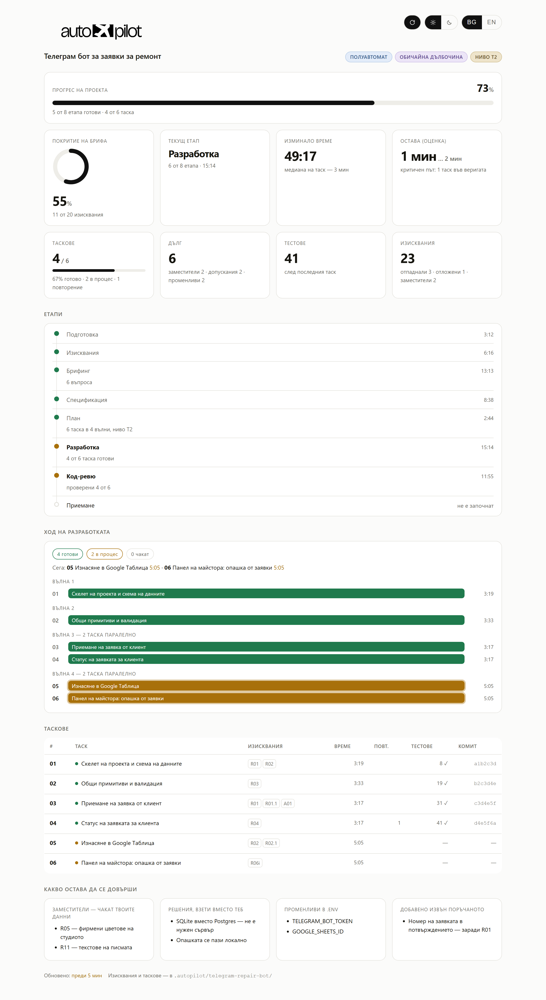

# autopilot

**Кажи с думи какво трябва да се построи — получи готов проект.**

Autopilot е рамка за разработка — умение (skill), което взема идеята ти и задава въпроси точно там, където в нея има развилки. Оттам нататък поема всичко: пише спецификацията, обмисля това, за което ти не си се сетил, разделя работата на таскове и сглобява проекта. Не ти трябва да четеш спецификации, да оценяваш таскове или да разбираш от код.

Работи самостоятелно — нищо друго не се инсталира.

> 🇧🇬 Това е **българският превод** на [Autopilot от Nick Vels](https://github.com/nick-vels/skills).
> Кодът и логиката са непроменени; преведени са текстовете към потребителя, документацията и таблото.
> Оригиналът е под MIT лиценз — виж [Лиценз](#лиценз).



И през цялото време виждаш какво се случва. В началото агентът сам отваря таблото — един HTML файл, който не трябва да търсиш и стартираш. На него се вижда колко от проекта е зад гърба ти, каква част от твоята задача вече е затворена, на кой етап е сглобяването, какво се прави точно сега и колко още остава. Часовниците вървят на живо, страницата се обновява сама, интернет не е нужен.

---

## Инсталиране

### Не искаш да отваряш терминал

Отвори своя AI агент — Claude Code, Cursor, Codex — и му подай този текст:

```
Инсталирай ми умението Autopilot на български. Изпълни в терминала:
npx skills add AleikovStudio/autopilot-bg --skill autopilot -g -y -a <сложи себе си: claude-code, cursor, codex>
Ако npx не се намери — дай ми линк откъде да сваля Node.js и изчакай.
Нищо друго не инсталирай.
Когато приключиш — напиши на един ред какво е готово и че трябва да рестартирам сесията.
```

Агентът ще свърши всичко сам. След това го рестартирай — уменията се четат при стартиране.

Това е командата за **първа инсталация**. За обновяване по-късно има [друга команда](#обновяване-и-премахване).

### През терминал

```bash
npx skills add AleikovStudio/autopilot-bg
```

Инсталаторът ще пита кои умения да сложи и за кои агенти — просто потвърди.

<details>
<summary>Инсталиране с една команда, без въпроси</summary>

```bash
npx skills add AleikovStudio/autopilot-bg --skill autopilot -g -y -a claude-code
```

Замени `claude-code` със своя агент: `cursor`, `codex` и т.н.
</details>

<details>
<summary>Без npx — ръчно копиране</summary>

Командите презаписват предишна инсталация на умението, ако има такава.

**Windows (PowerShell)**
```bash
$t="$env:TEMP\ap-bg"; $d="$env:USERPROFILE\.claude\skills\autopilot"; if (Test-Path $t) { Remove-Item $t -Recurse -Force }; git clone --depth 1 https://github.com/AleikovStudio/autopilot-bg.git $t; if (Test-Path $d) { Remove-Item $d -Recurse -Force }; New-Item -ItemType Directory -Force -Path $d | Out-Null; Copy-Item "$t\skills\autopilot\*" $d -Recurse -Force; Remove-Item $t -Recurse -Force; "Готово: $d"
```

**macOS / Linux**
```bash
rm -rf /tmp/ap-bg && git clone --depth 1 https://github.com/AleikovStudio/autopilot-bg.git /tmp/ap-bg && mkdir -p ~/.claude/skills && rm -rf ~/.claude/skills/autopilot && cp -r /tmp/ap-bg/skills/autopilot ~/.claude/skills/autopilot && rm -rf /tmp/ap-bg && echo "Готово: ~/.claude/skills/autopilot"
```

Или натисни зеленото **Code → Download ZIP**, разархивирай и копирай **съдържанието** на папката `skills/autopilot` (файлът `SKILL.md` и папката `phases`) в `~/.claude/skills/autopilot/`. Внимавай да не се получи вложена папка `autopilot/autopilot` — вътре трябва да стои директно `SKILL.md`.
</details>

Нужни са: Node.js (за `npx`) и някой поддържан AI агент — Claude Code, Cursor, Codex и още десетки. Нищо повече.

---

## Как се използва

Отвори агента в папката на бъдещия проект и напиши:

```
/autopilot Искам телеграм бот, който приема заявки за ремонт на техника
и ги записва в Google Таблица
```

Или просто опиши задачата със свои думи — агентът сам ще разбере, че е време да включи Autopilot:

```
Направи ми до ключ сайт-визитка за студио за маникюр, не ме питай излишно
```

**Ако задачата е голяма — напиши я във файл.** В един ред чат подробно описание не се побира, а и не бива да пестиш: колкото повече разкажеш, толкова по-малко ще се домисля вместо теб. Създай файл до проекта — името е без значение, `brief.md`, `идея.txt`, `задача.md` — и опиши там всичко свободно: какъв е проектът, за кого е, какво трябва да може, какво не ти харесва при конкурентите, какви са ограниченията по пари и срокове. После просто посочи файла:

```
/autopilot brief.md
/autopilot deep docs/идея.md само без плащане с карта
```

Агентът ще прочете файла и ще вземе съдържанието му като задача; твоят файл остава непокътнат, а копие от него ляга в `.autopilot/` — точно с него накрая се сверява резултатът. Думите, дописани до пътя, влизат в същата задача.

Нататък остава само да отговориш на няколко въпроса в самото начало.

В отговор агентът първо ще каже в какъв режим работи и какви други има, и сам ще отвори таблото — така че да не помниш команди и да не търсиш файлове:

```
Режим: полуавтомат · дълбочина: обичайна — ще питам само това, което не е ясно
от задачата, останалото поемам аз.
Отворих таблото: .autopilot/dashboard.html — обновява се само.
Памет за проекта — AGENTS.md (+ CLAUDE.md с връзка към него). Кажи, ако искаш друг файл.

Може да превключиш по всяко време, просто кажи:
• „пълен автомат“ — не питам нищо
• „ръчен режим“ — одобряваш спецификацията и списъка с таскове
• „строго по брифа“ / „помисли задълбочено“ — по-малко или повече домисляне
```

---

## Три режима

След `/autopilot` можеш да допишеш колко плътно искаш да участваш. Нищо не си написал — работи полуавтоматът.

| Режим | Как се включва | Какво те питат |
|---|---|---|
| **Пълен автомат** | `/autopilot full ...` или „пълен автомат“ | Нищо. Накрая — списък с решенията, взети вместо теб |
| **Полуавтомат** *(по подразбиране)* | нищо не се дописва | Само това, което задачата не определя: обикновено 2–8 въпроса. Всичко е еднозначно — нито един; задачата е голяма и сурова — колкото трябва |
| **Ръчен** | `/autopilot manual ...` или „ръчен режим“ | Въпроси, после твоето „ок“ на спецификацията и на списъка с таскове |

```
/autopilot full лендинг за доставка на пица
/autopilot Телеграм бот за записване на маникюр
/autopilot manual CRM за автосервиз, искам сам да одобря спецификацията
```

Думите `full`, `semi`, `manual` се пишат без тирета. Режимът може да се смени в движение — „превключи на ръчен“, прилага се от следващия етап.

**Какво не се променя в нито един режим:** агентът ще пита преди необратимо действие — публикуване, плащане, разпращане, изтриване на данни. И нито един режим не изключва сверката с твоята първоначална задача.

---

## Дълбочина на разработване

Отделна ръчка, независима от режима. Режимът решава **колко ще те питат**; дълбочината — **колко ще домислят вместо теб**.

| Дълбочина | Как се включва | Какво прави агентът |
|---|---|---|
| **Строго** | `/autopilot strict ...` или „строго по брифа“, „не добавяй нищо“ | Само това, което си написал. Никакви свои функции — дори добри. Грешките и празните състояния пак се обработват: без тях изискването просто не работи |
| **Обичайна** *(по подразбиране)* | нищо не се дописва | Запълва пропуските, които явно ще развалят резултата. Може да добави и свое, но задължително вързано за твое изискване |
| **Максимална** | `/autopilot deep ...` или „помисли задълбочено“, „помисли вместо мен“ | Всяко изискване минава през пълния списък: първо стартиране, празен екран, грешен вход, отказ, прекъсване, растеж, права, последствия |

```
/autopilot strict форма за обратна връзка, точно както я описах
/autopilot deep онлайн магазин за керамика
/autopilot full deep маркетплейс за майстори
```

Редът на думите няма значение, и двата параметъра са по избор. Дълбочината, както и режимът, се сменя в движение: „по-малко самодейност“ или „помисли по-задълбочено“.

**На всяка дълбочина важи едно правило:** всичко, което агентът е добавил от себе си, е вързано за твое изискване и влиза в крайния отчет като отделен списък. Функция, която не е вързана за нищо, се изрязва.

---

## Две неща, които Autopilot прави различно

### Задачата ти не се губи по пътя

Обичайният проблем при сглобяване „по описание“: продиктувал си голям бриф, после тръгват въпроси, спецификация, таскове, код — а накрая половината от това, което си искал, просто го няма. Не защото са ти отказали, а защото на някоя стъпка е спряло да се споменава.

Autopilot първо разделя текста ти на номерирани изисквания и ги записва **дословно** във файл. Нататък всяко изискване има статус, а на всеки етап стои проверка:

- **след спецификацията** — нито едно изискване не е останало без раздел;
- **след разделянето** — всяко изискване има таск, и всеки таск има изискване (това хваща работа, която никой не е поръчвал);
- **накрая — сляпо приемане:** отделен агент получава само твоя първоначален текст и готовия проект, спецификацията не му се дава. Той проверява резултата срещу **твоите думи**, а не срещу преразказ. Ако той и манифестът се разминат — ще го видиш в отчета.

**Изискване може да свали само ти.** Агентът има право да предложи отлагане — да зачеркне няма право. Мълчанието не се смята за отмяна.

### Това, за което не си се сетил, се обмисля вместо теб

В брифа описваш как всичко работи, когато всичко е наред. Не описваш какво да се покаже на празен екран, какво става при прекъсната връзка, какво се случва, ако натиснеш „изпрати“ два пъти, и какво вижда човек при първото стартиране. Това не е пропуск — просто не е нивото, на което се формулира задача.

Да се обмисли това е голяма част от стойността на Autopilot, а обемът на тази работа го задаваш ти с **дълбочината**. При обичайна дълбочина агентът затваря пропуските, които явно ще развалят резултата; при максимална — прекарва всяко изискване през пълния списък. Нещо ще реши сам (текст на грешка, разумни лимити), а нещо, където решението наистина е твое, ще изнесе като въпрос.

При максимална дълбочина едно изискване от брифа се разгръща в няколко разработени сценария — толкова, колкото страни реално има. Това е разликата между „работи на демо“ и „работи“.

---

## Прогресът се вижда винаги

`.autopilot/dashboard.html` се отваря сам в самото начало — нищо не трябва да търсиш и стартираш. Ако агентът умее да показва страница в собствения си прозорец (например панел в приложението Claude), таблото ще се отвори там и всичко остава в един прозорец; иначе — във външен браузър. Един файл, работи офлайн. Докато сглобяването върви, страницата се обновява сама на всеки десет секунди; бутонът ⟳ горе го изключва, ако пречи. До него — превключватели за тема (светла / тъмна) и език (**BG / EN**); докато не си пипал темата, таблото следва системната. Етикетите за режим, дълбочина и ниво са оцветени: синьото семейство е режимът, виолетовото — дълбочината, охрата — обемът работа.

**Етапите на целия цикъл са пред очите ти.** Осем стъпки от подготовка до приемане: подготовка, изисквания, брифинг, спецификация, план, разработка, код-ревю, приемане. Вижда се кои са минати, кой върви сега, кои са пропуснати и защо („ниво T0 — без разбивка на таскове“, „пълен автомат — самобрифинг“) и кои още предстоят.

**Времето върви в реално време.** Общ часовник на сглобяването, часовник на текущия етап и часовник на текущия таск тиктакат посекундно; при минатите етапи и готовите таскове се вижда колко е отнел всеки. Когато сглобяването приключи, часовниците спират на крайните цифри.

**Ход на разработката — какво е готово и какво се прави точно сега.** Щом планът е разделен, всички таскове се виждат наведнъж: колко са готови, колко са в процес, колко чакат реда си. Вървящите таскове са назовани по име, с тиктакащ часовник до всеки; готовите — с времето, което са отнели. Тасковете, които не зависят един от друг, се сглобяват паралелно, и точно тук се вижда колко от тях летят едновременно.

**Лентата отгоре** е прогресът на целия проект, от нула до готов резултат. Тя отчита и минатите етапи, и дела готови таскове вътре в разработката, затова пълзи с всеки таск, а не стои половин ден на едно място.

| Показател | Какво означава |
|---|---|
| **Прогрес на проекта** | Една цифра „колко остава до края“ — по етапи и таскове заедно |
| **Покритие на брифа** | Колко от твоите изисквания са наистина затворени. Главната цифра: тасковете може да са готови на 100%, а брифът — на 70% |
| **Текущ етап** | Къде е сглобяването в цикъла и откога върви този етап |
| **Изминало / остава** | Общо време и оценка по критичния път — по най-дългата верига зависими таскове, не по сбора на останалите |
| **Таскове** | Колко са направени от колко и колко са точно сега в процес. При малки проекти — „без разбивка“: таскове там няма по замисъл |
| **Дълг** | Заместители, решения, взети вместо теб, незапълнени променливи. Това е, което отделя „работи“ от „работи при теб“ |
| **Тестове** | Колко са минали след всеки таск — регресията се вижда веднага, а не накрая |
| **Повторения и време на таск** | Вижда се къде сглобяването е буксувало |

Дори когато проектът е малък и няма смисъл да се дели на таскове, таблото не е празно: етапите, изискванията, тестовете, комитът и заместителите се попълват по същия начин. Ако сесията прекъсне — кажи „продължи автопилота“ и агентът ще вдигне състоянието от файловете и ще продължи оттам, докъдето е стигнал.

---

## Проектът помни себе си

Обичайната беда на втората сесия: агентът отваря готов проект и половин час разбира какво изобщо е построено тук — за твоя сметка. Autopilot закрива това с файл-описание на проекта в корена: `AGENTS.md` или `CLAUDE.md` — този, който чете твоят агент.

Файлът се появява веднага, още преди първия ред код: име, стек, команди за стартиране. Нататък там влиза само това, което реално се е изяснило в движение — истинската команда за тестове, капаните, на които вече са стъпили, нова променлива на средата. А накрая отделен агент чете **готовия код** (не спецификацията — иначе описанието щеше да разказва за планове) и дописва архитектурата: как частите са свързани, какво къде стои, какво не бива да се пипа.

| | |
|---|---|
| **Кой файл** | Определя се сам: работиш в Claude Code — `CLAUDE.md`, в Cursor или Codex — `AGENTS.md`. Вече има един от тях — пишем в него. Не е ясно — `AGENTS.md`, а до него `CLAUDE.md` с един ред връзка |
| **Обем** | Според размера на проекта: за лендинг — команди, структура и капани; за голям проект — плюс ключови файлове, конвенции, променливи и тестове |
| **Твоят текст** | Всичко, което си написал ти, е неприкосновено. Autopilot пише само вътре в своите маркери и никога не пипа останалото |

Няма да те питат за това — в началото ще дойде един ред „Памет за проекта — AGENTS.md“. Не е този файл — просто кажи и ще го смени.

---

## Как работи

Главният принцип: **редът и е продуктът.** Кодът се пише в предпоследната фаза, всичко преди нея е изясняване какво точно да се строи, всичко след нея — доказателство, че е построено точно това.

| Фаза | Какво се случва |
|---|---|
| **Подготовка** | Настройка на папката, `.gitignore`, приборите — таблото се отваря веднага |
| **Изисквания** | Твоят текст → номерирани изисквания, дословно |
| **Брифинг** | Въпроси само по реални развилки, първи — тези, без чийто отговор проектът не се сглобява: плащане, хостинг, достъпи |
| **Спецификация** | Изискванията се разгръщат в разработени сценарии |
| **План** | Спецификацията се реже на таскове — или не се реже, ако задачата е малка — и се разпределя на вълни: какво може да се сглобява едновременно и какво само по ред |
| **Разработка** | Един таск = един отделен агент с чиста памет, един комит; независимите таскове вървят паралелно |
| **Код-ревю** | След всеки таск: съответствие с брифа, съответствие със спецификацията, качество на кода |
| **Приемане** | Отделен агент стартира проекта и сверява резултата с твоята първоначална задача, описание на проекта за в бъдеще, отчет |

### За разделянето на таскове

Всеки таск е отделен агент, който наново влиза в проекта: чете контрактите, изучава кода, разбира се със стека. Това струва скъпо. Затова Autopilot реже по нива, а не по принципа „колкото по-дребно, толкова по-надеждно“:

| Задача | Колко таска |
|---|---|
| Малка — лендинг, форма, скрипт | **нула.** Сглобява се на един път |
| Една свързана функционалност | 2–3 |
| Няколко функционалности или слоя | 4–8 |
| Няколко независими подсистеми | 9–16 |

Повече от 16 е забранено — работата се разделя на две отделни сглобявания. Дребното нарязване не купува надеждност, купува разход.

### За разработката

| Какво прави Autopilot | Защо |
|---|---|
| Всеки таск се изпълнява от отделен агент | Не се обърква в натрупания контекст и не чупи това, което е работело |
| Предава на следващия агент контрактите на предишните | Иначе шестата задача наново ще изобрети това, което е построила третата |
| Независимите таскове вървят паралелно, по няколко агента наведнъж | Да чакаш по ред неща, които не зависят едно от друго, са часове на празно |
| Един комит на таск | Твоите точки за връщане назад |
| Тасковете с общи файлове вървят по ред | Иначе двама агенти ще презапишат работата си |
| Пълно пускане на тестовете след всеки таск | Регресията струва минути, а не цяла вечер |
| Паднал таск — повторение, после опит по друг начин | Ако и той не мине, агентът спира и обяснява по човешки |
| План, който се е разминал с кода, се поправя на глас | Ако в движение се окаже, че замисленото не работи, агентът поправя плана и ти казва с един ред — а не строи мълчаливо нещо друго |

---

## Кога да се използва и кога не

**Подходящо е, ако:**

- описваш какво ти трябва и чакаш готов резултат;
- не си програмист и няма да четеш спецификации и код;
- „направи го до ключ“, „just build it“, „не ме питай излишно“;
- искаш да одобриш спецификацията и списъка с таскове, но не да се занимаваш с процеса — това е ръчният режим.

**Не е подходящо, ако:**

| Ситуация | Какво да направиш вместо това |
|---|---|
| Искаш да пишеш код заедно, ред по ред | Работи с агента директно |
| Задачата е поправка в един файл | Просто помоли да я направи |
| Идеята е по-голяма от един проект, крайната цел е неясна | Първо определи целта |

---

## Ключове, пароли и достъпи

Autopilot **никога не пита за ключове, токени и пароли** — само с каква услуга искаш да работиш и имаш ли акаунт там.

- въпросът ще е „приемаме плащане през Stripe или ePay?“, а не „изпрати ключа“;
- в кода ще се появи име на променлива — `STRIPE_SECRET_KEY`, стойността я въвеждаш ти в `.env`;
- `.env` влиза веднага в `.gitignore`;
- в отчета — списък на променливите, които остава да се попълнят, с имена без стойности.

Ако все пак изпратиш ключ в чата, той няма да попадне в нито един файл: преди запис целият ти текст минава през филтър, който разпознава ключове на Stripe, GitHub, AWS, Google, Slack, токени на Telegram, JWT и низове за връзка. Вместо стойността във файла ще отиде `[REDACTED:STRIPE_SECRET_KEY]`, а до теб ще дойде предупреждение — ключ, минал през кореспонденция, е добре да се анулира и да се издаде нов.

---

## Какво Autopilot никога не прави

- не пише код, преди да се е появила спецификация;
- не зачерква твои изисквания — само ти можеш;
- не си измисля факти за теб: цени, текстове и адреси остават видими заместители, а не правдоподобна лъжа;
- не те кара да проверяваш таскове, размера им или кода;
- не пуска две задачи в една памет на агент;
- не оставя плащането, достъпите и хостинга за финала;
- не иска и не запазва твоите ключове и пароли;
- не инсталира и не сваля нищо без твое знание.

---

## Обновяване и премахване

Обновява **само** `update`. Не преинсталирай умението с командата от раздела „Инсталиране“ — тя е за първа инсталация; за обновяване има отделна команда:

```bash
npx skills update autopilot -g
```

Флагът `-g` е ако умението е слагано глобално. За проектна инсталация пусни командата без флага в папката на съответния проект.

<details>
<summary>Ако умението се държи като стара версия</summary>

`update` сверява версията на източника, а не файловете на диска: ако локалното копие е пипано или се е повредило, той ще отговори „всичко вече е обновено“ и няма да направи нищо. Лекува се с преинсталиране:

```bash
npx skills remove autopilot -g -y && npx skills add AleikovStudio/autopilot-bg --skill autopilot -g -y -a claude-code
```
</details>

Да видиш какво е инсталирано и да премахнеш:

```bash
npx skills list
npx skills remove autopilot -g
```

За да види агентът новата версия, рестартирай сесията — уменията се четат при стартиране.

---

## Какво има в репозиторията

```
skills/autopilot/
├── SKILL.md                    ← оркестраторът: режими, фази, гейтове
└── phases/                     ← правилата на фазите, четат се по една, в момента на фазата
    ├── 0-preflight.md          подготовка на репозиторията
    ├── 1-manifest.md           бриф → изисквания, филтър за секрети
    ├── 2-briefing.md           въпроси към потребителя
    ├── 3-spec.md               спецификация и разработване на дълбочината
    ├── 4-plan.md               разделяне на таскове, нива
    ├── 5-subagents.md          агентите изпълнители и контрактите между тях
    ├── 6-review.md             проверка по три оси
    ├── 7-instruments.md        състояние и табло
    ├── 8-final.md              сляпо приемане и отчет
    ├── 9-memory.md             описание на проекта в CLAUDE.md / AGENTS.md
    └── dashboard-template.html готовото табло с вграденото лого
assets/                         ← снимка на таблото за това README
```

Файловете в `phases/` се четат от агента по един, само когато започне съответната фаза — затова в паметта винаги стои точно това, което е нужно сега.

Всичко това е обикновен markdown. Може да се отвори и прочете: [`skills/autopilot/SKILL.md`](skills/autopilot/SKILL.md).

---

## Лиценз

**MIT © Nick Vels** — може да се използва, променя и разпространява, включително в комерсиални проекти.

Оригинален проект: [github.com/nick-vels/skills](https://github.com/nick-vels/skills)
Български превод: [AleikovStudio](https://github.com/AleikovStudio)

Пълният текст на лиценза е в [`LICENSE`](LICENSE). Известието за авторски права на оригиналния автор е запазено, както изисква MIT.
